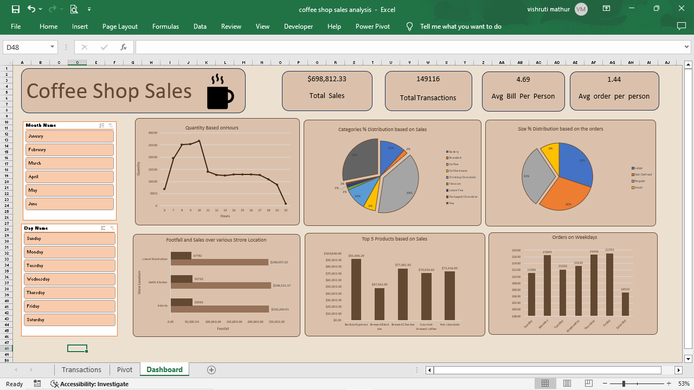

# Coffee Shop Sales Analysis Dashboard

## Overview

This project involves a comprehensive analysis of coffee shop sales data, visualized through an interactive Excel dashboard. The dashboard helps answer key business questions, providing insights into sales trends, peak times, revenue, store performance, product popularity, and more.

## Key Features

Sales Variation by Day and Hour: Visualizes how sales fluctuate across different days of the week and specific hours of the day.
Peak Sales Times: Identifies the busiest periods in the day.
Monthly Sales Revenue: Displays total sales revenue for each month.
Sales by Store Location: Compares sales performance across different store locations.
Average Price per Order: Calculates the average price per order per person.
Best-Selling Products: Highlights the top-selling products in terms of quantity and revenue.
Sales by Product Category and Type: Analyzes sales distribution across various product categories and types.

## Dataset

The dataset used in this project includes daily sales data, product details, store locations, and customer transactions. The data was sourced from [].

## Project Structure

Dashboard: The interactive dashboard is created in Excel and provides insights at a glance.
Analysis: Detailed analysis performed in Excel, with visualizations and metrics highlighted in the dashboard.
Installation
To view the dashboard, download the Excel file and open it in Excel. Ensure macros are enabled if interactive features are used.

## Usage

Interactive Filters: The dashboard includes interactive filters for day, hour, location, and product category. Use these to explore the data from different perspectives.
Tooltips: Hover over the charts to get detailed information on sales metrics.
Drill-Down: Click on specific elements to drill down into more detailed views.
Visuals

## Below is a preview of the dashboard:
 

## Contributing
Feel free to fork this project, submit issues, or suggest improvements. Contributions are welcome!
